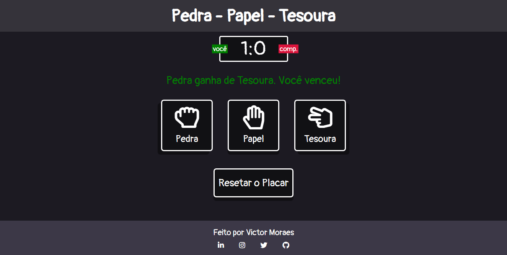

# Pedra, Papel e Tesoura

Simples jogo de Pedra, Papel e Tesoura, utilizando HTML5, CSS3 e Javascript puro.

## Guia
- [Descrição](#ancora1)
- [Screenshots](#ancora2)
  - [Versão Desktop](#ancora3)
  - [Versões de Tablet e Celulares](#ancora4)

  
## :pushpin: Descrição

O projeto consiste em um clássico jogo de Pedra, Papel e Tesoura, onde o usuário enfrentará o computador.

Basicamente o usuário poderá escolher entre três movimentos (*Pedra, Papel e Tesoura*). A escolha do usuário será comparada com a escolha do computador, definida randomicamente através de um **array**. O placar exibido ao topo será atualizado de acordo com os acontecimentos do jogo, mostrando a pontuação atual.

No campo de resultado, localizado logo abaixo do placar, será exibida uma mensagem, variando de acordo com as três possibilidades (*vitória do usuário, empate ou derrota do usuário*):

- Em caso de vitória, a mensagem é exibida na cor **verde**. O placar é atualizado atribuindo um ponto ao usuário;
- Em caso de derrota, a mensagem é exibida na cor **carmesim**. O placar é atualizado atribuindo um ponto ao computador;
- Por último, em caso de empate, a mensagem é exibida na cor **cinza**. Neste caso, **nenhum dos lados recebe ponto**;

Também é disponibilizado ao usuário a opção de zerar o placar do jogo, caso, por exemplo, outra pessoa queira iniciar o jogo. Basta apenas clicar no botão *"Resetar o Placar"*. Uma mensagem de alerta irá aparecer, perguntando se o usuário de fato deseja ou não resetar o seu jogo.

## :camera_flash: Screenshots

### :desktop_computer: Versão Desktop

[:top: Voltar ao Topo](#ancora)

### :iphone: Versões de Tablet e Celulares

#### Tablet

  

#### Celulares

  

[:top: Voltar ao Topo](#ancora)